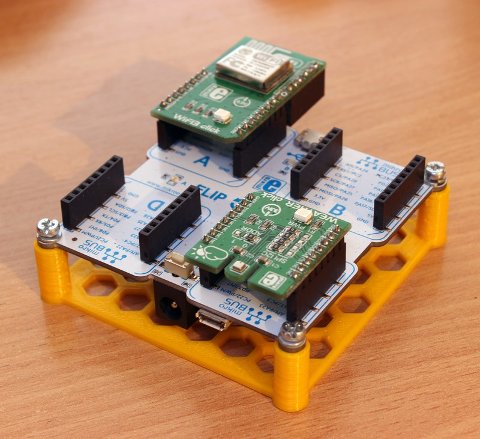
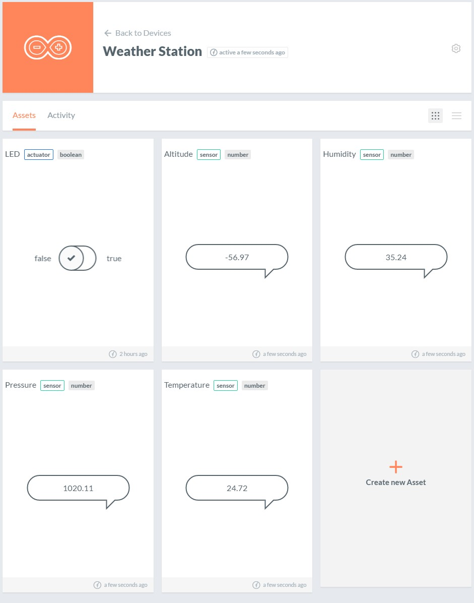
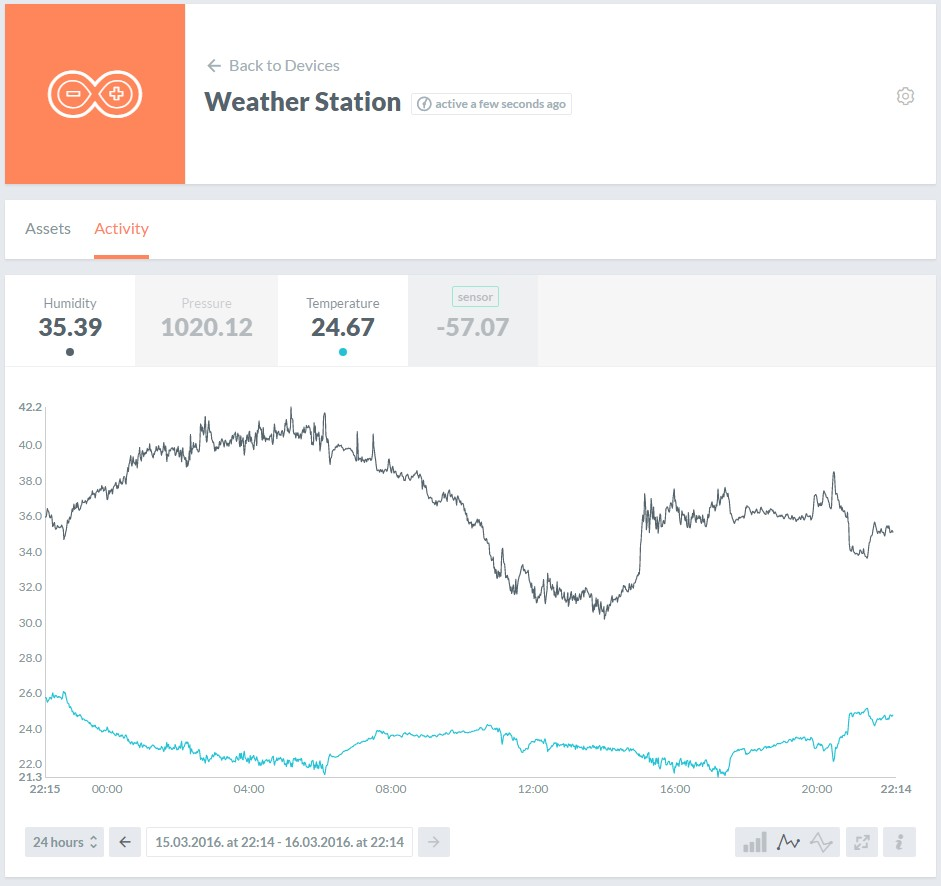

# IoT Weather Station

Simple IoT Weather Station using AllThingsTalk platform, running on Mikroelektronika's Flip&Click (Arduino Due) board.



## What's this all about?

This project aims to demonstrate integration of Mikroelektronika's hardware components with [AllThingsTalk][2ccabd85] IoT platform.

We're using [BME280][c1c4043e] all-on-one environmental sensor and ESP8266 to communicate data to cloud based system.

The device is sending `temperature`, `humidity`, `pressure` and derived `altitude`. There's also a `LED` actuator which you can toggle from the web to show off push functionality.

## Ingredients

- Mikroelektronika's [Flip&Click][43250e5f] flavor of Arduino Due
- [WiFi3 Click][f990c72e] board (ESP8266)
- [Weather Click][1d509331] board
- _USB to Serial_ TTL Adapter (for flashing the ESP8266)
- Account on [AllThingsTalk Maker][f3deb3b1]

## Hardware setup

While hardware is mostly Plug&Play, some setup is required to get this up and running:

- Male headers need to be soldered to click boards
- 1x8 header needs to be soldered to WiFi3 click board (_warning_, this is not included in the package), as you'll need it to flash the firmware onto ESP8266. You can use either male or female headers, just make sure to watch the spacing and that it matches your USB-Serial adapter.

### Flashing ESP8266 (WiFi3 Click)

WiFi3 Click board is actually a well known inexpensive [ESP8266 WiFi SOC][4284e0fb] in disguise. By default it comes with AT command based firmware for data and connection management. We could use it directly, however as we'd like to use both HTTP and MQTT APIs, implementing those wrappers from scratch over AT commands would probably be both time consuming and prone to bugs, therefore we'll be using [**espduino**][425072b6] project which aims to provide _REST and MQTT client over serial_, exactly what we need here.

Naturally, if you're so inclined, you can program the ESP8266 using [Arduino code directly][3eee6168], as it is supported as one of the Arduino Cores, however we're just going to add connectivity to Flip&Click (Due) board for now.

You can follow [this extensive guide][8903f031] on Hackaday to program ESP chip with [_espduino_][425072b6] firmware.

Use [_esptool_][382eeed8] or other flasher of your choice ([nodemcu-flasher][da407e76] should work too)

> esp8266/tools/esptool.py -p COM1 write_flash 0x00000 esp8266/release/0x00000.bin 0x40000 esp8266/release/0x40000.bin

Once flashed, you should be able to verify the ESP8266/espduino works by listening for serial data. It should print out debug information (e.g. MAC address) at the top, simillar to this:

```
mode : sta(xx:xx:xx:xx:xx:xx)
```

## Software setup

First, install [Arduino IDE][6befd720]. Afterwards, go to `Tools > Board > Boards Manager` and install `Arduino SAM Boards (32-bits ARM Cortex-M3)` which will add support for Arduino Due development.

Next, we'll need some libraries. These can be installed either through `Sketch > Include Library > Manage Libraries` (if available) or by getting `master` version of library from github and installing it manually.

These libraries are required:

- [Adafruit Sensor][6914c721]
- [Adafruit BME280][13fdf1eb]
- [Arduino JSON][2098bab3]
- [espduino][425072b6]

## Connecting to Cloud

We're using AllThingsTalk as our platform of choice for this IoT project, as we can easily provision custom IoT devices like this one.

After you've created your account on [AllThingsTalk Maker][f3deb3b1], log in, go to `Playground` if you're not already there.

Navigate to `Devices > Make new Device`, pick `Custom`, and name it however you'd like.

You can use `Arduino` type as well, however, once created, device will contain some preset assets which you can delete as we won't be using them here. There's also an example sketch you could use to get up and running quickly, however it's only usable for regular Arduino projects which have on board connectivity (e.g. Arduino Ethernet or Arduino ESP8266 Core).

Next, make a copy of `credentials_sample.h` called `credentials.h` in the same directory and fill in the details (You can find your AllThingsTalk credentials in the right pane of device page).

And... we're all set!

## Putting it all together

By this point the project should be able to compile without any warnings/errors.

Let's assemble the hardware first:

- Place WiFi3 Click into slot **A**
- Place Weather Click into slot **C**
- Connect Flip&Click to your computer using USB cable (make sure you use programming port on Flip&Click, one next to power connector), select appropriate port from Arduino IDE and click `Upload`.

You can monitor `debug` output using Arduino's `Serial Monitor`. If your WiFi/AllThingsTalk credentials are correct you should see assets appearing on the device page and their data being updated in a real time as they arrive.



You should enable `Activity Log` from device settings pane if you'd like to retain historical data and plot them on the `Activity` page.



## Little bits...

You can adapt this project to your needs, the `Device` API is quite simple:

### Setting assets

You can add `sensors` or `actuators` directly from the device. This is useful in cases where you want devices to provision themselves. Otherwise you can create asset from the web interface and just send/receive data from/to them.

You can use `addAsset(name, type, profileType)` API, e.g.

```c
// four environmental sensors
device.addAsset(S_TMP, AssetType::sensor, "number");
device.addAsset(S_PSA, AssetType::sensor, "number");
device.addAsset(S_HUM, AssetType::sensor, "number");
device.addAsset(S_ALT, AssetType::sensor, "number");

// and a LED actuator you can toggle
device.addAsset(A_LED, AssetType::actuator, "boolean");
```

### Sending data

Use `send(name, value)` API to send data to cloud, e.g.:

```c
device.send("Temperature", "10.0");
device.send("Door_Lock", "true");
device.send("Message", "Hello World!");
```

### Receiving data

If `Command Handler` is attached by using `device.setCommandHandler(&handler)`, the `handler` function will be invoked each time data is sent to your device. You're presented with `Command` structure which contains `name`, identifying the asset, and `value` being value that is sent from Cloud.

### Echoing commands

Sometimes it's useful for a device to confirm it has in fact received data being sent to it (e.g. so that you could verify it has actually been received). You can either do that manually from `Command Handler` by calling `send(name, value)` or setting `device.setAutoEcho(true);`, as in that case the received value will be sent back immediately.

## Bonus

3D printable bracket is included in the [`res`][13a45bb0] directory, in case you'd like to have a nice place to keep your weather station, or hang it up on the wall. Uses `3mm` holes. Also available on [thingiverse] (http://www.thingiverse.com/thing:1422608).

Have fun!

[2098bab3]: https://github.com/bblanchon/ArduinoJson "Arduino JSON"
[6914c721]: https://github.com/adafruit/Adafruit_Sensor "Adafruit Unified Sensor Driver"
[13fdf1eb]: https://github.com/adafruit/Adafruit_BME280_Library "Adafruit BME280"
[6befd720]: https://www.arduino.cc/en/Main/Software "Arduino Download"
[3eee6168]: https://github.com/esp8266/Arduino "ESP-Arduino"
[425072b6]: https://github.com/tuanpmt/espduino "espduino"
[4284e0fb]: https://en.wikipedia.org/wiki/ESP8266 "ESP8266"
[382eeed8]: https://github.com/themadinventor/esptool "esptool"
[da407e76]: https://github.com/nodemcu/nodemcu-flasher "nodemcu-flasher"
[2ccabd85]: http://allthingstalk.com/ "AllThingsTalk"
[8903f031]: http://hackaday.com/2015/03/18/how-to-directly-program-an-inexpensive-esp8266-wifi-module/ "HOW TO DIRECTLY PROGRAM AN INEXPENSIVE ESP8266 WIFI MODULE"
[f3deb3b1]: https://maker.allthingstalk.com/ "Maker"
[f990c72e]: http://www.mikroe.com/click/wifi3/ "WiFi3"
[1d509331]: http://www.mikroe.com/click/weather/ "Weather"
[c1c4043e]: https://www.adafruit.com/datasheets/BST-BME280_DS001-10.pdf "BME280"
[43250e5f]: http://www.mikroe.com/flip-n-click/ "Flip&Click"
[13a45bb0]: res/ "res"
